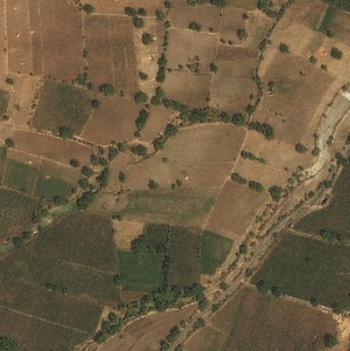

# SRGAN: Super-Resolution Generative Adversarial Network

This repository contains the implementation of the SRGAN (Super-Resolution Generative Adversarial Network) model for image super-resolution.

## Overview

SRGAN is a deep learning model that uses generative adversarial networks (GANs) to enhance the resolution of low-resolution images by predicting their high-resolution counterparts. This method is particularly effective in producing realistic and high-quality images, making it suitable for applications in various fields such as medical imaging, satellite imaging, and more.

## Features

- Implementation of the SRGAN architecture.
- Pre-trained models for quick inference.
- Scripts for training the SRGAN model on custom datasets.
- Evaluation metrics for comparing performance with other super-resolution methods.

## Results

Example results obtained using the SRGAN model:

| Low-Resolution Image | Super-Resolution Image | 
|----------------------|------------------------|
|  |  | 

## References

- [Photo-Realistic Single Image Super-Resolution Using a Generative Adversarial Network (CVPR 2017)](https://arxiv.org/abs/1609.04802)

